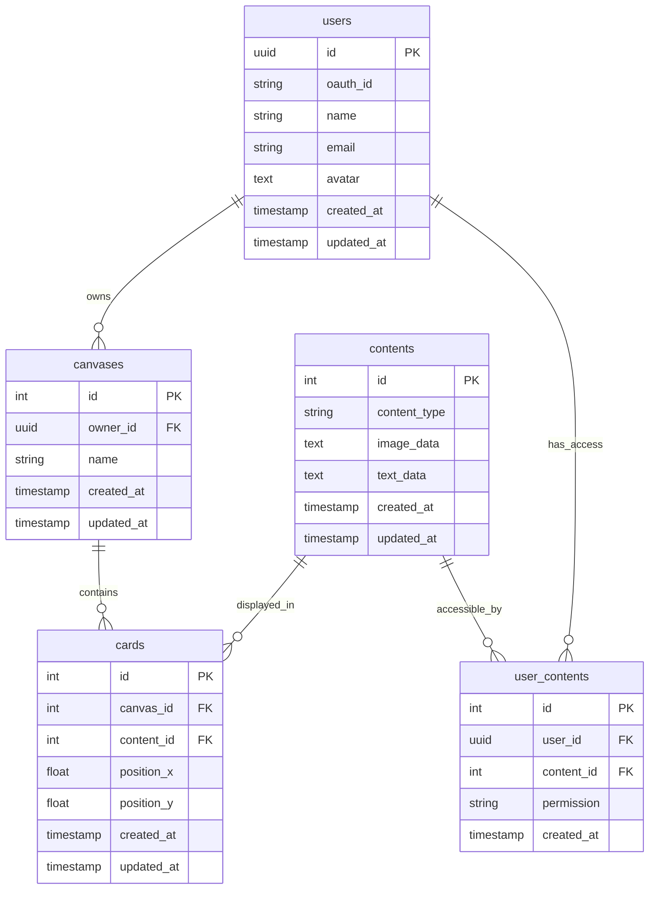

# 设计文档

## 概述

该设计实现了一个协作画布系统，支持多用户实时协作。系统基于现有的 FastAPI 架构，添加了画布管理、卡片操作和内容管理功能。设计遵循 MVP 原则，专注于核心功能的快速实现。

## 架构

### 系统架构图

```mermaid
graph TB
    Client[前端客户端] --> API[FastAPI 路由层]
    API --> Auth[认证中间件]
    Auth --> Service[业务服务层]
    Service --> CRUD[数据访问层]
    CRUD --> DB[(PostgreSQL 数据库)]
    
    subgraph "API 层"
        API --> CanvaRouter[画布路由]
        CanvaRouter --> PullEndpoint[/api/v2/canva/pull]
        CanvaRouter --> PushEndpoint[/api/v2/canva/push]
    end
    
    subgraph "服务层"
        Service --> CanvaService[画布服务]
        Service --> ContentService[内容服务]
        Service --> AuthService[认证服务]
    end
    
    subgraph "数据层"
        DB --> CanvaTable[canvases 表]
        DB --> CardTable[cards 表]
        DB --> ContentTable[contents 表]
        DB --> UserContentTable[user_contents 表]
        DB --> UserTable[users 表]
    end
```

### 技术栈

- **后端框架**: FastAPI (现有)
- **数据库**: PostgreSQL (现有)
- **ORM**: SQLAlchemy (现有)
- **认证**: UUID-based 用户认证 (现有用户系统)
- **API 版本**: v2 (与现有结构一致)

## 组件和接口

### 1. 数据模型

#### Canvas 模型
```python
class Canvas(Base):
    __tablename__ = "canvases"
    
    id = Column(Integer, primary_key=True, index=True)
    owner_id = Column(UUID(as_uuid=True), ForeignKey("users.id"))
    name = Column(String(255), nullable=True)
    created_at = Column(DateTime(timezone=True), server_default=func.now())
    updated_at = Column(DateTime(timezone=True), onupdate=func.now())
```

#### Card 模型
```python
class Card(Base):
    __tablename__ = "cards"
    
    id = Column(Integer, primary_key=True, index=True)
    canvas_id = Column(Integer, ForeignKey("canvases.id"))
    content_id = Column(Integer, ForeignKey("contents.id"))
    position_x = Column(Float, nullable=False)
    position_y = Column(Float, nullable=False)
    created_at = Column(DateTime(timezone=True), server_default=func.now())
    updated_at = Column(DateTime(timezone=True), onupdate=func.now())
```

#### Content 模型
```python
class Content(Base):
    __tablename__ = "contents"
    
    id = Column(Integer, primary_key=True, index=True)
    content_type = Column(String(50), nullable=False)  # 'image', 'text'
    image_data = Column(Text, nullable=True)  # Base64 编码的图片
    text_data = Column(Text, nullable=True)
    created_at = Column(DateTime(timezone=True), server_default=func.now())
    updated_at = Column(DateTime(timezone=True), onupdate=func.now())
```

#### UserContent 模型 (多对多关系)
```python
class UserContent(Base):
    __tablename__ = "user_contents"
    
    id = Column(Integer, primary_key=True, index=True)
    user_id = Column(UUID(as_uuid=True), ForeignKey("users.id"))
    content_id = Column(Integer, ForeignKey("contents.id"))
    permission = Column(String(20), default="read")  # 'read', 'write', 'owner'
    created_at = Column(DateTime(timezone=True), server_default=func.now())
```

### 2. API 接口

#### Pull API
```python
@router.post("/pull")
async def pull_canvas(
    request: CanvaPullRequest,
    current_user: User = Depends(get_current_user),
    db: Session = Depends(get_db)
) -> List[CardResponse]
```

#### Push API
```python
@router.post("/push")
async def push_canvas(
    cards: List[CardUpdateRequest],
    current_user: User = Depends(get_current_user),
    db: Session = Depends(get_db)
) -> None
```

### 3. 数据传输对象 (DTOs)

#### 请求模型
```python
class CanvaPullRequest(BaseModel):
    canva_id: int

class CardUpdateRequest(BaseModel):
    card_id: int
    position: PositionModel
    content_id: int

class PositionModel(BaseModel):
    x: float
    y: float
```

#### 响应模型
```python
class CardResponse(BaseModel):
    card_id: int
    position: PositionModel
    content_id: int

    class Config:
        from_attributes = True
```

### 4. 服务层

#### CanvaService
```python
class CanvaService:
    def __init__(self, db: Session):
        self.db = db
    
    async def get_canvas_cards(self, canvas_id: int, user_id: UUID) -> List[Card]
    async def update_canvas_cards(self, cards: List[CardUpdateRequest], user_id: UUID) -> None
    async def verify_canvas_access(self, canvas_id: int, user_id: UUID) -> bool
```

#### ContentService
```python
class ContentService:
    def __init__(self, db: Session):
        self.db = db
    
    async def get_user_contents(self, user_id: UUID) -> List[Content]
    async def verify_content_access(self, content_id: int, user_id: UUID) -> bool
    async def create_content(self, content_data: dict, user_id: UUID) -> Content
```

## 数据模型

### 数据库表结构

```sql
-- 画布表
CREATE TABLE canvases (
    id SERIAL PRIMARY KEY,
    owner_id UUID REFERENCES users(id),
    name VARCHAR(255),
    created_at TIMESTAMP WITH TIME ZONE DEFAULT NOW(),
    updated_at TIMESTAMP WITH TIME ZONE DEFAULT NOW()
);

-- 内容表
CREATE TABLE contents (
    id SERIAL PRIMARY KEY,
    content_type VARCHAR(50) NOT NULL,
    image_data TEXT,
    text_data TEXT,
    created_at TIMESTAMP WITH TIME ZONE DEFAULT NOW(),
    updated_at TIMESTAMP WITH TIME ZONE DEFAULT NOW()
);

-- 卡片表
CREATE TABLE cards (
    id SERIAL PRIMARY KEY,
    canvas_id INTEGER REFERENCES canvases(id) ON DELETE CASCADE,
    content_id INTEGER REFERENCES contents(id),
    position_x FLOAT NOT NULL,
    position_y FLOAT NOT NULL,
    created_at TIMESTAMP WITH TIME ZONE DEFAULT NOW(),
    updated_at TIMESTAMP WITH TIME ZONE DEFAULT NOW()
);

-- 用户内容关联表
CREATE TABLE user_contents (
    id SERIAL PRIMARY KEY,
    user_id UUID REFERENCES users(id),
    content_id INTEGER REFERENCES contents(id),
    permission VARCHAR(20) DEFAULT 'read',
    created_at TIMESTAMP WITH TIME ZONE DEFAULT NOW(),
    UNIQUE(user_id, content_id)
);

-- 索引优化
CREATE INDEX idx_cards_canvas_id ON cards(canvas_id);
CREATE INDEX idx_cards_content_id ON cards(content_id);
CREATE INDEX idx_user_contents_user_id ON user_contents(user_id);
CREATE INDEX idx_user_contents_content_id ON user_contents(content_id);
CREATE INDEX idx_canvases_owner_id ON canvases(owner_id);
```

### 数据关系



## 错误处理

### HTTP 状态码策略

- **200 OK**: 成功操作
- **400 Bad Request**: 请求数据格式错误
- **401 Unauthorized**: 用户未认证
- **403 Forbidden**: 用户无权限访问资源
- **404 Not Found**: 资源不存在
- **500 Internal Server Error**: 服务器内部错误

### 错误响应格式

```python
class ErrorResponse(BaseModel):
    error: str
    message: str
    details: Optional[dict] = None

# 示例错误响应
{
    "error": "CANVAS_NOT_FOUND",
    "message": "指定的画布不存在",
    "details": {"canvas_id": 12}
}
```

### 异常处理策略

```python
class CanvaNotFoundError(HTTPException):
    def __init__(self, canvas_id: int):
        super().__init__(
            status_code=404,
            detail=f"Canvas with id {canvas_id} not found"
        )

class InsufficientPermissionError(HTTPException):
    def __init__(self, resource: str):
        super().__init__(
            status_code=403,
            detail=f"Insufficient permission to access {resource}"
        )
```

## 测试策略

### 单元测试

- **模型测试**: 验证数据模型的约束和关系
- **服务测试**: 测试业务逻辑和数据操作
- **API 测试**: 测试端点的输入输出和错误处理

### 集成测试

- **数据库集成**: 测试数据持久化和查询
- **认证集成**: 测试用户认证和授权流程
- **API 集成**: 测试完整的请求-响应流程

### 测试数据

```python
# 测试用例数据
test_canvas_data = {
    "canva_id": 12,
    "cards": [
        {
            "card_id": 101,
            "position": {"x": 12.12, "y": 86.21},
            "content_id": 104
        },
        {
            "card_id": 102,
            "position": {"x": 22.42, "y": 81.15},
            "content_id": 101
        }
    ]
}
```

### 性能考虑

- **数据库索引**: 在关键查询字段上创建索引
- **查询优化**: 使用 JOIN 减少数据库查询次数
- **缓存策略**: 对频繁访问的画布数据进行缓存（未来优化）
- **分页支持**: 对大型画布支持分页加载（未来优化）

## 安全考虑

### 认证和授权

- **UUID 认证**: 使用现有的用户 UUID 系统
- **权限验证**: 每个操作都验证用户权限
- **资源隔离**: 用户只能访问授权的内容

### 数据验证

- **输入验证**: 验证所有 API 输入数据
- **SQL 注入防护**: 使用 SQLAlchemy ORM 防止 SQL 注入
- **XSS 防护**: 对用户输入进行适当的转义和验证

### 审计日志

```python
# 关键操作的审计日志
logger.info(f"User {user_id} accessed canvas {canvas_id}")
logger.warning(f"Unauthorized access attempt by user {user_id} to canvas {canvas_id}")
```