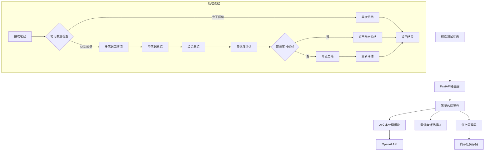

# 笔记总结工作流设计文档

## 概述

笔记总结工作流是一个基于FastAPI的智能笔记处理系统，通过多阶段的文本分析和总结来帮助用户完善笔记内容。系统采用异步处理架构，支持配置化的处理策略，并提供简洁的JSON API接口。

## 架构

### 系统架构图



### 技术栈

- **后端框架**: FastAPI
- **AI服务**: OpenAI API (与现有OCR服务共用配置)
- **文本处理**: Python标准库 + 自定义算法
- **任务管理**: 内存存储 (MVP版本)
- **前端**: 简单HTML + JavaScript
- **数学公式**: MathJax

## 组件和接口

### 1. API路由层

**文件位置**: `app/api/v2/endpoints/notes.py`

```python
# 主要端点
POST /api/v2/notes/summarize
GET /api/v2/notes/summarize/{task_id}
```

**请求格式**:
```json
{
    "notes": [
        {
            "title": "笔记标题1",
            "content": "笔记内容1..."
        },
        {
            "title": "笔记标题2", 
            "content": "笔记内容2..."
        }
    ],
    "min_notes_threshold": 3  // 可选，默认为3
}
```

**响应格式**:
```json
{
    "task_id": "uuid-string",
    "status": "completed",
    "result": {
        "title": "综合总结标题",
        "topic": "主要主题",
        "content": "# 总结内容\n\n使用Markdown格式...",
        "confidence_scores": [85.2, 72.1, 91.3],
        "processing_method": "multi_note_workflow"
    },
    "created_at": "2025-01-26T10:00:00Z",
    "completed_at": "2025-01-26T10:00:30Z"
}
```

### 2. 笔记总结服务

**文件位置**: `app/services/note_summary_service.py`

**核心类**:
- `NoteSummaryService`: 主服务类
- `SummaryTask`: 任务数据模型
- `NoteProcessor`: 笔记处理器
- `ConfidenceCalculator`: 置信度计算器

**主要方法**:
```python
class NoteSummaryService:
    async def create_summary_task(notes: List[NoteInput]) -> str
    async def get_task_status(task_id: str) -> SummaryTask
    async def process_notes(task_id: str) -> None
    def _should_use_multi_workflow(note_count: int) -> bool
    async def _single_summary(notes: List[str]) -> SummaryResult
    async def _multi_note_workflow(notes: List[str]) -> SummaryResult
```

### 3. AI文本处理模块

**文件位置**: `app/utils/text_processing.py`

**功能**:
- 单笔记知识点提取和总结
- 多笔记综合总结生成
- 文本修正和优化

**提示词模板**:
```python
SINGLE_NOTE_SUMMARY_PROMPT = """
请为以下笔记生成结构化的知识点总结：
- 提取主要知识点
- 保持核心信息完整
- 使用简洁的中文表达
- 支持数学公式（MathJax格式）

笔记内容：
{note_content}
"""

COMPREHENSIVE_SUMMARY_PROMPT = """
基于以下多份笔记总结，生成一份综合总结：
- 整合相关知识点
- 去除重复内容
- 突出核心要点
- 体现笔记间关联性

总结内容：
{summaries}
"""
```

### 4. 置信度计算模块

**文件位置**: `app/utils/confidence_calculator.py`

**算法**:
- 文本相似度计算（余弦相似度）
- 关键词重叠度分析
- 语义一致性评估

```python
class ConfidenceCalculator:
    def calculate_similarity(text1: str, text2: str) -> float
    def extract_keywords(text: str) -> List[str]
    def semantic_consistency_score(texts: List[str]) -> float
```

### 5. 任务管理器

**文件位置**: `app/services/task_manager.py`

**功能**:
- 任务创建和状态跟踪
- 异步任务执行
- 错误处理和重试机制

```python
class TaskManager:
    def __init__(self):
        self.tasks: Dict[str, SummaryTask] = {}
        self.executor = ThreadPoolExecutor(max_workers=4)
    
    async def create_task(self, notes: List[NoteInput]) -> str
    async def get_task(self, task_id: str) -> Optional[SummaryTask]
    async def execute_task(self, task_id: str) -> None
```

## 数据模型

### 核心数据结构

```python
from pydantic import BaseModel
from typing import List, Optional
from datetime import datetime

class NoteInput(BaseModel):
    title: str
    content: str

class SummaryRequest(BaseModel):
    notes: List[NoteInput]
    min_notes_threshold: Optional[int] = 3

class SummaryResult(BaseModel):
    title: str
    topic: str
    content: str  # Markdown格式
    confidence_scores: List[float]
    processing_method: str

class SummaryTask(BaseModel):
    task_id: str
    status: str  # pending, processing, completed, failed
    notes: List[NoteInput]
    result: Optional[SummaryResult]
    error_message: Optional[str]
    created_at: datetime
    completed_at: Optional[datetime]
```

## 错误处理

### 错误类型和处理策略

1. **输入验证错误**
   - 空笔记内容过滤
   - 格式验证
   - 返回400状态码

2. **AI服务错误**
   - API调用失败重试（最多3次）
   - 降级处理策略
   - 返回502状态码

3. **任务处理错误**
   - 任务超时处理（5分钟）
   - 状态回滚机制
   - 错误信息记录

4. **系统资源错误**
   - 并发限制（最多10个任务）
   - 内存使用监控
   - 返回503状态码

### 错误响应格式

```json
{
    "error": {
        "code": "PROCESSING_FAILED",
        "message": "笔记处理失败",
        "details": "AI服务暂时不可用，请稍后重试"
    },
    "task_id": "uuid-string",
    "timestamp": "2025-01-26T10:00:00Z"
}
```

## 测试策略

### 单元测试

**文件位置**: `tests/unit/test_note_summary.py`

**测试覆盖**:
- 笔记输入验证
- 单笔记总结功能
- 多笔记工作流逻辑
- 置信度计算准确性
- 错误处理机制

### 集成测试

**文件位置**: `tests/integration/test_note_api.py`

**测试场景**:
- API端点完整流程
- 异步任务处理
- AI服务集成
- 错误恢复机制

### 测试页面

**文件位置**: `static/note_summary_test.html`

**功能**:
- 多笔记输入界面
- 实时状态显示
- Markdown渲染
- MathJax公式支持
- 错误信息展示

**页面结构**:
```html
<!DOCTYPE html>
<html>
<head>
    <title>笔记总结测试</title>
    <script src="https://polyfill.io/v3/polyfill.min.js?features=es6"></script>
    <script id="MathJax-script" async src="https://cdn.jsdelivr.net/npm/mathjax@3/es5/tex-mml-chtml.js"></script>
</head>
<body>
    <div id="note-input-section">
        <!-- 笔记输入区域 -->
    </div>
    <div id="result-section">
        <!-- 结果显示区域 -->
    </div>
</body>
</html>
```

## 配置管理

### 新增配置项

**文件位置**: `app/core/config.py`

```python
class Settings:
    # 笔记总结配置
    NOTE_MIN_THRESHOLD = int(os.getenv("NOTE_MIN_THRESHOLD", "3"))
    NOTE_MAX_CONCURRENT_TASKS = int(os.getenv("NOTE_MAX_CONCURRENT_TASKS", "10"))
    NOTE_TASK_TIMEOUT = int(os.getenv("NOTE_TASK_TIMEOUT", "300"))  # 5分钟
    NOTE_CONFIDENCE_THRESHOLD = float(os.getenv("NOTE_CONFIDENCE_THRESHOLD", "0.6"))
    NOTE_MAX_CONTENT_LENGTH = int(os.getenv("NOTE_MAX_CONTENT_LENGTH", "2000"))
    
    # AI模型配置（复用现有OCR配置）
    NOTE_AI_MODEL = os.getenv("NOTE_AI_MODEL", "gpt-4o")
```

## 部署考虑

### MVP版本限制

1. **内存存储**: 任务数据存储在内存中，重启后丢失
2. **单实例**: 不支持多实例部署
3. **简单认证**: 暂不集成用户认证系统
4. **基础监控**: 仅提供基本的错误日志

### 扩展性设计

1. **数据库集成**: 预留数据库模型接口
2. **缓存支持**: 支持Redis缓存集成
3. **消息队列**: 支持Celery异步任务队列
4. **监控指标**: 预留性能监控接口

## 性能优化

### 处理优化

1. **并发控制**: 限制同时处理的任务数量
2. **内容长度限制**: 控制单笔记最大长度
3. **缓存机制**: 相似笔记结果缓存
4. **批处理**: AI API调用批量优化

### 响应优化

1. **异步处理**: 长时间任务异步执行
2. **流式响应**: 支持处理状态实时更新
3. **压缩传输**: API响应内容压缩
4. **CDN支持**: 静态资源CDN加速